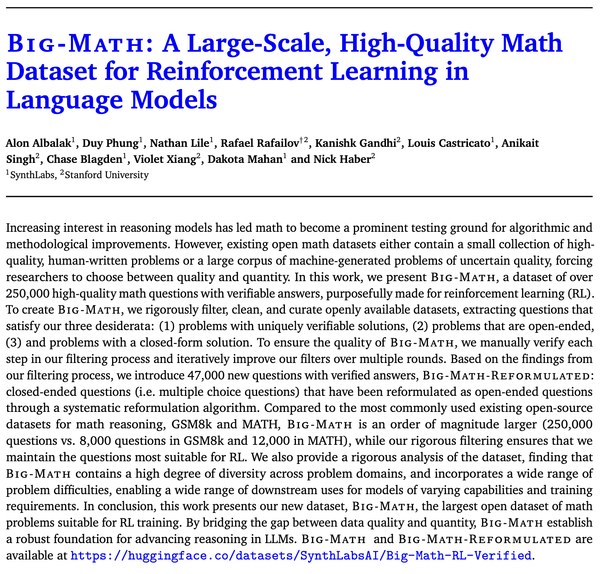

# Big-Math: A Large-Scale, High-Quality Math Dataset for Reinforcement Learning in Language Models

<details open>
    <summary>Click to collapse paper preview</summary>
    <p align="center">
        
    </p>
</details>

<p align="center">
        <a href="https://arxiv.org/abs/2502.17387" target="_blank" rel="noopener noreferrer">
                
        </a>
        <a href="https://huggingface.co/datasets/SynthLabsAI/Big-Math-RL-Verified">
                
        </a>
</p>

<p align="center">
        <a href="https://forms.synthlabs.ai/big-math" target="_blank" rel="noopener noreferrer">
                
        </a>
        <a href="https://forms.synthlabs.ai/big-math" target="_blank" rel="noopener noreferrer">
                
        </a>
</p>

## Introduction

Welcome to the official repository for **Big-Math**, a large-scale, high-quality dataset designed specifically for RL training ([PPO](https://arxiv.org/abs/1707.06347), [GRPO](https://arxiv.org/abs/2402.03300), etc.) with large language models (LLMs).

This repository provides tools for reformulating multiple-choice questions and implementing rule-based and model-based filtering as described in the [Big-Math paper](https://alon-albalak.github.io/images/Big_MATH.pdf).

Find the dataset on HuggingFace at [https://huggingface.co/datasets/SynthLabsAI/Big-Math-RL-Verified](https://huggingface.co/datasets/SynthLabsAI/Big-Math-RL-Verified)


> [!WARNING]
> This repo is intended for research purposes, and is thus under constant development. Please expect major changes to the design.
> The primary goal of the big-math repo is to share the filtering and reformulation code for creating the Big-MATH dataset and to speed the development of future datasets.
> The Big-Math dataset is intended only for RL training of LLMs, it does not contain rollouts

## Repository Structure

This repo consists of 2 main directories: signals and reformulation.

### Signals

This folder contains code used to generate signals on a dataset. The below signals can be generated either using rule-based methods or model-based methods:

| Signal                | Rule-Based | Model-Based |
|-----------------------|------------|-------------|
| Hyperlink Detection       | ✅         |             |
| Language Identification |          |    ✅         |
| Semantic Duplicate       |          | ✅            |
| Multiple Choice Question | ✅       | ✅        |
| Multi-Part Question     | ✅         |  ✅           |
| True/False Question       | ✅         |   ✅          |
| Yes/No Question     | ✅     | ✅    |
| Proof Detection       | ✅         |   ✅          |
| Model Solve Rate      |            | ✅          |

### Reformulation

This folder contains code used to reformulate multiple choice problems to open-ended questions.

## 🚀 Getting Started

### Prerequisites
- python 3.10+
- install with packages in `signals/requirements.txt` to generate signals on a dataset
- install with packages in `reformulation/requirements.txt` to reformulate multiple choicen questions into open-ended questions

### Installation
1. Clone the repository:
        ```bash
        git clone https://github.com/SynthLabsAI/big-math.git
        cd big-math
        ```
2. Install dependencies
        ```bash
        pip install -r signals/requirements.txt -r reformulation/requirements.txt
        ```

### 🛠 Usage

#### Reformulation
See [the reformulation readme](https://github.com/SynthLabsAI/big-math/blob/master/reformulation/README.md) for an explanation of files and usage.

#### Signals
See [the signals readme](https://github.com/SynthLabsAI/big-math/blob/master/signals/README.md) for an explanation of files and usage.

## 📄 Citation

```bibtex
@misc{albalak2025bigmathlargescalehighqualitymath,
      title={Big-Math: A Large-Scale, High-Quality Math Dataset for Reinforcement Learning in Language Models}, 
      author={Alon Albalak and Duy Phung and Nathan Lile and Rafael Rafailov and Kanishk Gandhi and Louis Castricato and Anikait Singh and Chase Blagden and Violet Xiang and Dakota Mahan and Nick Haber},
      year={2025},
      eprint={2502.17387},
      archivePrefix={arXiv},
      primaryClass={cs.LG},
      url={https://arxiv.org/abs/2502.17387}, 
}
```

## License

This project is licensed under the MIT License. See the [LICENSE](https://github.com/SynthLabsAI/big-math/blob/master/LICENSE) for details.
