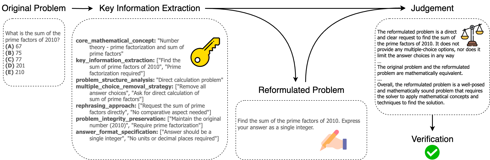

# Multiple Choice Reformulation

The **Multiple Choice Reformulator** is designed to transform multiple choice questions into open-ended questions using dspy. The tool is designed for research purposes.




## Folder Structure

- `main.py`: The main entry point for the reformulation process.
- `signatures.py`: Contains the function signatures and definitions for the dspy method used within the reformulator.
- `modules.py`: Houses the Reformulator class, which implements the core logic for converting MCQs to open-ended problems.
- `requirements.txt`: Make sure to install the dependencies as specified here.

## Setup and Configuration

### Step 1: Implement the `custom_load_dataset()` function
The entry point for running the reformulator is located in `main.py`. You need to implement the `custom_load_dataset()` function within this file to load your dataset of multiple-choice questions. This function should return the dataset in a format that the reformulator can process.

Here is a simple template using HuggingFace Datasets to get you started:
```python
from datasets import load_dataset
def custom_load_dataset(dataset_name):
    dataset = load_dataset(dataset_name, split="train")
    return dataset
```

### Step 2: Define the `API_CONFIGS` variable
Within `main.py`, you will also need to define the `API_CONFIGS` variable. This variable will store configuration information related to the model API you are using. Modify this section to suit your API configuration setup.

Example:
```python
# Server configurations
API_CONFIGS = {
    """Example"""
    "<Endpoint IP Address>": {
        "api_base": "http://<Endpoint IP Address>:<port>/v1",
        "api_key": "PROVIDER_API_KEY",
    },
    "123.456.789.012": {
        "api_base": "http://123.456.789.012:8000/v1",
        "api_key": "PROVIDER_API_KEY",
    },
}
```

### Step 3: Run the Reformulator
Once the dataset loading and API configurations are set up, you can execute the reformulator by running the following command:
```bash
python main.py
```
